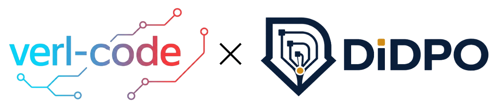

<h1 align="center">verl-code</h1>

<p align="center">
  
</p>

<h3 align="center">
<b>Reinforcement Learning for Multi-turn Coding Agents</b>
<br>
<b>with DiDPO — Diff-in-Diff Policy Optimization</b>
</h3>

<p align="center">
  <i>A practical SFT-to-RL stack for CodeRL-style multi-turn coding agents,
  built on top of verl-agent / veRL.</i>
</p>

<p align="center">
  <a href="#-news">News</a> •
  <a href="#-features">Features</a> •
  <a href="#-quick-start">Quick Start</a> •
  <a href="#-data">Data</a> •
  <a href="#-training">Training</a> •
  <a href="#-documentation">Documentation</a>
</p>

---

`verl-code` is an extension of veRL / verl-agent, specifically designed for
training **large language model (LLM) coding agents** with supervised
fine-tuning (SFT) and reinforcement learning (RL).

Unlike standard code-generation training that treats each problem as a
single-turn prompt-response pair, `verl-code` focuses on **multi-turn
code-repair rollouts**: an agent can reason, inspect files, execute tests, edit
code, observe feedback, and iteratively improve its solution. This design makes
`verl-code` suitable for long-horizon coding tasks where solving a problem may
require multiple rounds of interaction with an execution environment.

`verl-code` provides practical SFT and RL recipes for coding agents, including
GRPO baselines and our new algorithm **DiDPO**. DiDPO extends episode-level RL
with finer-grained credit assignment inside code-editing responses by grouping
aligned edited snippets across rollouts.

---

## 🔥 News

- Current main training path: **SFT -> GRPO / DiDPO** for CodeRL-style tasks.
- Main supported SFT recipes: **Qwen2.5-Coder-7B** and **Qwen3.5-4B**.
- Main DiDPO launcher: `scripts/launch_didpo_coderl_sft_mt8.sh`.

---

## ✨ Features

| Category | Support |
|---|---|
| Interaction | ✅ Multi-turn coding-agent training |
| Algorithms | ✅ GRPO / GiGPO / GSPO / DAPO / **DiDPO** |
| SFT | ✅ Multi-turn SFT from trajectory data |
| Models | ✅ Qwen2.5-Coder-7B / Qwen3.5-4B |
| Benchmarks | ✅ `apps_train_coderl` and related coding presets |
| Logging | ✅ console / SwanLab / checkpoint saving |
| Analysis | ✅ DiDPO group dump and plots |

---

## 🚀 Quick Start

```bash
git clone <YOUR_REPO_URL>
cd verl-code

pip install -e .
pip install -r requirements.txt

# prepare SFT data
bash scripts/build_apps_mt8_sft_dataset.sh

# SFT
bash examples/sft/apps_mt8/run_apps_mt8_sft.sh

# RL with DiDPO
bash scripts/launch_didpo_coderl_sft_mt8.sh
```

---

## 📦 Data

- **SFT dataset (HF):** `TODO_FILL_ME_SFT_DATASET_HF_LINK`
- **RL dataset (HF):** `TODO_FILL_ME_RL_DATASET_HF_LINK`

The default SFT data directory used by the launchers is:

```text
data/sft/apps_mt8_mix_think
```

---

## 🛠️ Installation

```bash
conda create -n verl-agent python=3.12 -y
conda activate verl-agent

git clone <YOUR_REPO_URL>
cd verl-code
pip install -e .
pip install -r requirements.txt
```

---

## 🧩 Data Preparation

Build the multi-turn SFT parquet:

```bash
cd verl-code
bash scripts/build_apps_mt8_sft_dataset.sh
```

If you use the think-injected version of the data, the common processed dataset
location is:

```bash
data/sft/apps_mt8_mix_think
```

---

## 🏋️ Training

### Run SFT

#### Qwen2.5-Coder-7B

```bash
cd verl-code
bash examples/sft/apps_mt8/run_apps_mt8_sft.sh
```

#### Qwen3.5-4B

```bash
cd verl-code
SFT_MODEL_PATH=/path/to/Qwen3.5-4B \
bash examples/sft/apps_mt8/run_apps_mt8_sft_qwen35_4b.sh
```

### Run RL

#### DiDPO

```bash
cd verl-code
bash scripts/launch_didpo_coderl_sft_mt8.sh
```

#### Qwen3.5-4B DiDPO

```bash
cd verl-code
MODEL_PATH=checkpoints/apps_mt8_sft_qwen35_4b_think/global_step_162 \
EXP_NAME=didpo_coderl_qwen35_4b_sft_mt8 \
PROJECT_NAME=didpo_coderl \
bash scripts/launch_didpo_coderl_sft_mt8.sh
```

#### Resume DiDPO

```bash
cd verl-code
bash scripts/launch_didpo_coderl_sft_mt8_resume20.sh
```

#### GRPO

See:

- `scripts/launch_grpo_coderl_sft_mt8.sh`
- `scripts/launch_grpo_coderl_qwen35_4b_sft_mt8.sh`

---

## 📁 Repository Layout

```text
verl-code/
├── agent_system/      # multi-turn coding environment
├── didpo/             # DiDPO algorithm and docs
├── examples/          # SFT / RL recipe entrypoints
├── scripts/           # launchers, data prep, eval scripts
├── logs/              # logs and collected trajectory files
├── checkpoints/       # SFT and RL checkpoints
└── verl/              # training/runtime backend
```

---

## 📚 Documentation

- [`didpo/README.md`](./didpo/README.md)
- [`didpo/HYPERPARAMETERS.md`](./didpo/HYPERPARAMETERS.md)
- [`didpo/PROJECT_CARD.md`](./didpo/PROJECT_CARD.md)
- [`didpo/PROJECT_METADATA.yaml`](./didpo/PROJECT_METADATA.yaml)

---

## Acknowledgement

This project builds on the verl-agent / veRL ecosystem and adapts it for
multi-turn coding-agent SFT and RL.
